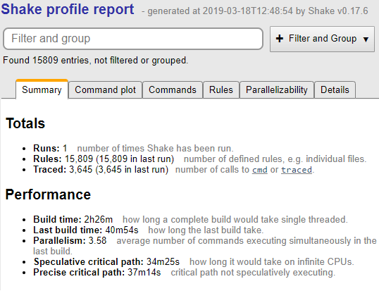
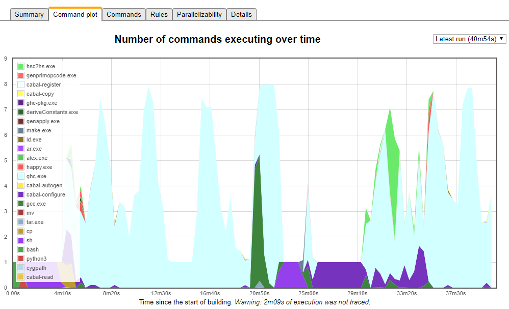
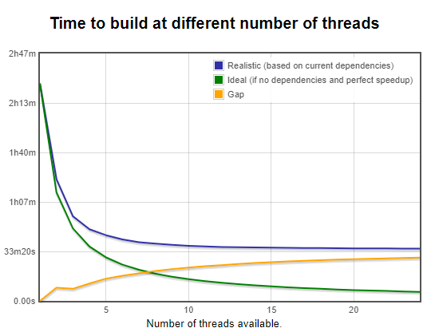
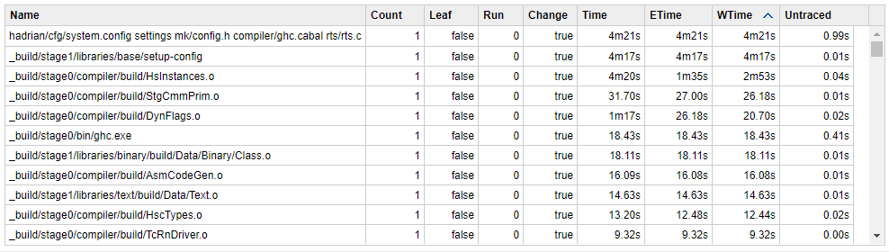
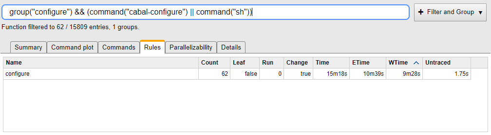
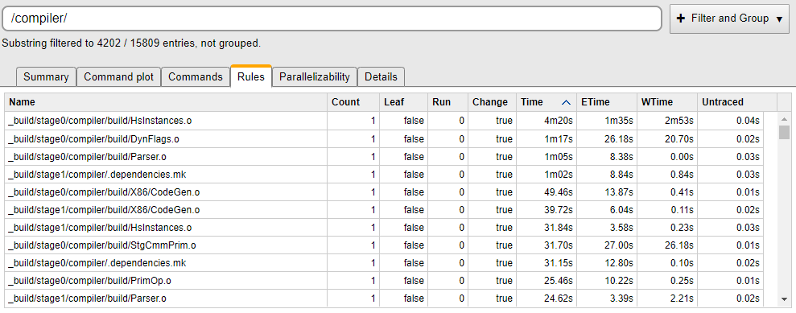
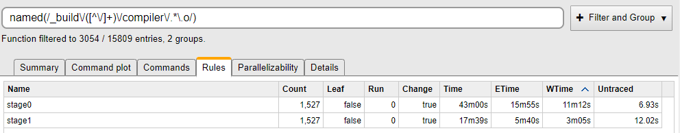

# GHC Rebuild Times

_Summary: GHC rebuild times are slow. Using the Shake profiler and Hadrian we can find out why._

I just checked out [GHC](https://www.haskell.org/ghc/), and using [Hadrian](https://blogs.ncl.ac.uk/andreymokhov/you-should-try-hadrian/) (the [Shake-based build system](https://shakebuild.com/)), built GHC on Windows using:

    hadrian\build.stack.bat -j --flavour=quickest --integer-simple --configure

Namely use `stack` to install dependencies and build Hadrian itself, then compile as quick as I can get it, on all CPUs (8 on my machine) and run `configure` for me. 40m54s later I had a built GHC. That's not a quick process! Why did it take so long? If I bought a better machine would it go faster? How might we optimise GHC? These questions and more can be answered with Shake profiling.

Shake has had profiling for years, but in the recently-released Shake 0.17.7 I've overhauled it. The profile report is generated as a web page, and the generated output in the new version is smaller (2x smaller), loads faster (100x or more) and is more intuitive (not really a numeric thing). In the rest of this post I'll pepper some screenshots from the Shake profiler without thoughts about what it could mean. I've also uploaded the profile so you can play around with it:

[Hadrian Profile](https://shakebuild.com/profile/hadrian-2019-03-18.html)

**Summary Page**

The first page you see when opening the report is the summary.

This page gives us some basic stats. There was 1 run (I built it and grabbed a profile with `--profile`). It ran 3,645 traced actions (e.g. command line calls or other expensive actions) and there were 15,809 rules run (where a rule is something with dependency information - somewhere between one third to two thirds of those are likely to be files in typical build systems).

Turning to performance, the entire build, on one CPU would take 2h26m. The build on my 8 CPU machine took 40m45s, with on average 3.58 commands going at once (quite a bit less than the 8 I wanted). The critical path is about 37m14s, so that's the lower bound with infinite CPUs, so buying a machine with more CPUs won't really help (faster CPUs and a faster disk probably would though).

OK, so I'm now unhappy that GHC doesn't execute enough in parallel. So let's see what it does manage to do in parallel by switching to the Command Plot.

**Command Plot**

We now see a graph of what was executing at each point during the build. We see spikes in a hideous light blue for GHC, showing that when GHC gets going, it can get near to the 8 CPUs we requested. However, we see lots of periods of time with only 1 task executing. In most cases these are either `sh` at the start (which I happen to know is `configure`), or `cabal-configure` (which is more obviously `configure`). However, there are also Haskell blips where we get down to 1 CPU. I'm now increasingly convinced that the biggest problem Hadrian has (performance wise) is lack of parallelism. To confirm that, let's switch to the Parallelizability tab.

**Parallelizability**

This next tab predicts how long it will take to build Hadrian at various different thread counts. The green line is if there were no dependencies, the blue line is with the dependencies we have, and the yellow line is the difference. As we can see, at 8 CPU's the difference is about 16m - I could have had my GHC a whole 16m faster if we could parallelise GHC more. At the same time, it looks like the sweet spot for compiling GHC is currently around 6 CPUs - more doesn't make a huge amount of difference. How sad. To investigate let's jump to the Rules tab.

**Rules**

Now we've moved on from pretty graphs to tables of rules. The most interesting columns for performance work are Time (how long something took), ETime (how long it took if you only pay for the fraction of the computer you are using) and WTime (how long you were the only thing running for). The first is most relevant if you want to take less CPU, the second two if you aren't hitting the parallelism you are hoping for. Since we aren't hitting the parallelism, we can sort by WTime.

For WTime, if we eliminated that step, the _total_ build would improve by that amount of time. Looking at the first two entries, which are the initial `configure` and then `configure` of the `base` library, we see a total of 8m38s. If we could get rid of configure, or speed it up, or interleave it with other operations, we could save almost 10 minutes off a GHC build. Using the search bar we can figure out how much configure costs us in total.

Now we have used the search bar to filter to only rules that run the command `cabal-configure` or `sh`, and we've named them all in the group `configure` (so it sums them up for us). We see we spend 15m18s configuring, and would go about 10m faster if we didn't - so it's expensive, and serialises the build a lot. I hate `configure`.

**Slow Stage0 Compilation**

Ignoring `configure`, the next slow things are building the `stage0` compiler, so let's focus in on that.

While we can use the search bar for entering JavasScript expressions, we can equally just enter substrings. Let's delve into `/compiler/` and sort by Time. We quickly see a bunch of `stage0` and `stage1` compiles, with `HsInstances.o` and `DynFlags.o` right at the top. Those files take a really long time to compile, and end up serialising the build quite a bit. However, it's a bit odd that we see `stage0`, but a lot less of `stage1`. Let's compare the two stages:

Now we're using a regular expression to pull out the `.o` compiles in `compiler`, and group them by their stage. We can see that both involve 1,527 compiles, but that `stage0` takes 43m, while `stage1` is under 18m. Why? Either we're using different sets of flags (e.g. compiling `stage0` with higher optimisations or warnings), _or_ GHC HEAD (the output of `stage0` which we use to compile `stage1`) is significantly faster than GHC 8.6.3 (which I used to compile `stage0`). I've no idea, but tracking down the difference could save at least 7 minutes on the wall clock time of GHC.

**Conclusion**

Compiling GHC is slow, but the biggest problem is it doesn't parallelise well. Using Shake profiling we've found that `configure` and `stage0` are the culprits.
