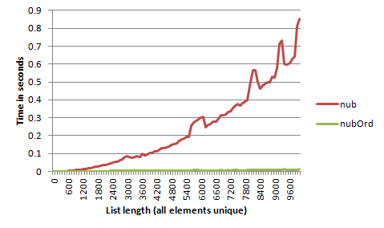

# `nub` considered harmful

_Summary: Don't use `nub`. A much faster alternative is [`nubOrd`](https://hackage.haskell.org/package/extra-1.1/docs/Data-List-Extra.html#v:nubOrd) from the [`extra`](https://hackage.haskell.org/package/extra) package._

The Haskell `Data.List` module contains the function [`nub`](https://hackage.haskell.org/package/base/docs/Data-List.html#v:nub), which removes duplicate elements. As an example:

    nub [1,2,1,3] ==  [1,2,3]

The function `nub` has the type `Eq a => [a] -> [a]`. The complexity of `take i $ nub xs` is _O(length xs * i)_. Assuming all elements are distinct and you want them all, that is _O(length xs ^ 2)_. If we only have an `Eq` instance, that's the best complexity we can achieve. The reason is that given a list `as ++ [b]`, to check if `b` should be in the output requires checking `b` for equality against `nub as`, which requires a linear scan. Since checking each element requires a linear scan, we end up with a quadratic complexity.

However, if we have an `Ord` instance (as we usually do), we have a complexity of _O(length xs * log i)_ - a function that grows significantly slower. The reason is that we can build a balanced binary-tree for the previous elements, and check each new element in _log_ time. Does that make a difference in practice? Yes. As the graph below shows, by the time we get to 10,000 elements, `nub` is 70 times slower. Even at 1,000 elements `nub` is 8 times slower.

The fact `nub` is dangerous isn't new information, and I even suggested [changing the `base` library](https://mail.haskell.org/pipermail/libraries/2007-March/007029.html) in 2007. Currently there seems to be a `nub` hit squad, including [Niklas Hambüchen](https://github.com/nh2), who go around raising tickets [against](https://github.com/ndmitchell/shake/issues/45) [various](https://github.com/mvoidex/hsdev/issues/12) [projects](https://github.com/jgm/pandoc/issues/1022) suggesting they avoid `nub`. To make that easier, I've added [`nubOrd`](https://hackage.haskell.org/package/extra-1.1/docs/Data-List-Extra.html#v:nubOrd) to my [`extra`](https://hackage.haskell.org/package/extra) package, in the [`Data.List.Extra`](https://hackage.haskell.org/package/extra-1.1/docs/Data-List-Extra.html) module. The function `nubOrd` has exactly the same semantics as `nub` (both strictness properties and ordering), but is asymptotically faster, so is almost a drop-in replacement (just the additional `Ord` context).

For the curious, the above graph was generated in Excel, with the code below. I expect the spikes in `nub` correspond to garbage collection, or just random machine fluctuations.

    import Control.Exception
    import Data.List.Extra
    import Control.Monad
    import System.Time.Extra

    benchmark xs = do
        n <- evaluate $ length xs
        (t1,_) <- duration $ evaluate $ length $ nub xs
        (t2,_) <- duration $ evaluate $ length $ nubOrd xs
        putStrLn $ show n ++ "," ++ show t1 ++ "," ++ show t2

    main = do
        forM_ [0,100..10000] $ \i -> benchmark $ replicate i 1
        forM_ [0,100..10000] $ \i -> benchmark [1..i]
