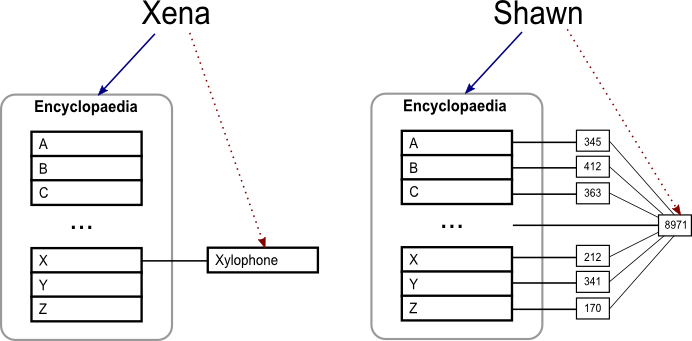
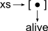
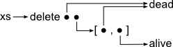

# Leaking Space

A _space leak_ occurs when a program uses more memory than necessary. In contrast to memory leaks, where the memory is never released, the memory consumed by a space leak is released, merely later than expected. Garbage collection has largely eliminated memory leaks, but making memory management automatic can make unexpected space leaks more likely. In this article we'll go through some example space leaks, discuss how to spot space leaks, and how to eliminate them.

### Real life space leaks

Before we get to space leaks in computer programs, let's consider two "real life" space leaks. Xena the xylophone enthusiast buys a 26 volume printed encyclopaedia, but she only wants to read the article on xylophones. The encyclopaedia occupies a lot of space on her bookshelf, but Xena could throw away all but the X volume, reducing the shelf requirements. Furthermore, she could cut out the Xylophone article, leaving only a single piece of paper. In this example Xena is storing lots of information, but is only interested in a small subset of it.

Xena's friend Shawn the statistician is curious how many redundant pages Xena is storing, which requires knowing the total number of pages in the encyclopaedia. To determine the page count Shawn buys a copy of the encyclopaedia. While the full encyclopaedia is 26 volumes, he is only interested in the number of pages per volume. Furthermore, rather than being interested in the sizes of 26 separate volumes, he is really only interested in the total size - information that could be written on the back of a stamp. In this example Shawn is storing lots of information, and while each volume contains useful information, the result can be stored more succinctly.

----------

Figure 1: The information of interest to Xena and Shawn.

----------

In Figure 1 we sketch the memory layout Xena and Shawn might represent if they were computer programs. In both cases there is a solid blue arrow pointing to the encyclopaedia, representing the memory that is being retained. There is also a dotted red arrow pointing at the information that is actually useful.

A space leak would occur if a program loaded the encyclopaedia, but did not immediately reduce it to the interesting part, resulting in the encyclopaedia being kept in memory longer than necessary. Eliminating space leaks is about controlling when evaluation occurs, reducing the time between allocating memory and discarding it. Unsurprisingly, features that complicate evaluation order are particularly vulnerable to space leaks - the two examples this article focuses on are lazy-evaluation (where evaluation of an expression is delayed until its value is needed) and closures (a function value combined with its environment). Both these features are found in lazy functional languages, such as Haskell.

### Example 1: `delete`

First let's look at how lazy evaluation can cause a space leak. Consider the following Haskell definition:

    xs = delete dead [alive, dead]

This fragment creates a variable `xs`. We create a two element list using the `[_,_]` notation, containing both `alive` and `dead`, then we remove the element `dead` from the list using `delete`. If we call `length xs` it will return 1, indicating there is only one element in `xs`. In the absence of lazy evaluation, the memory layout would be:

Here `xs` references a list containing `alive` as the only element, `dead` is not referenced, and thus can be garbage collected. But Haskell uses lazy evaluation (also known as call-by-need), so after defining `xs` the memory would be:

Instead of pointing at a _value_, `xs` points at an _expression_, which may be replaced with an actual value later. There are still two paths from `xs` to `dead`, thus `dead` cannot be garbage collected, even though we know that `dead` will never be used. The variable `dead` is part of a space leak because `delete` is being evaluated later than we would like.

As previously mentioned, `length xs` will return 1, but as a consequence of computing the length, it will evaluate `delete`. The act of evaluating `length xs` reduces `xs` to a value, which eliminates the space leak. A program using lists can end up with a space leak if it frequently adds and deletes elements, but never uses the list to compute the length or look up values.

More generally, a space leak can occur when the memory contains an expression, where the expression grows regularly, but where the evaluated value would not grow. Such leaks are usually solved by forcing the evaluation, making evaluation of some variable _strict_ instead of lazy.  

### Forcing Evaluation

In Example 1, we happen to know that `length` will force `delete` to be evaluated. We use the following definitions to describe how evaluated an expression is:

* An expression is in **normal form** if it cannot be evaluated further. For example, the list `[1,2]` is in normal form. Lists are constructed from `[]` (pronounced "nil") for the empty list, and `(:)` (pronounced "cons") to combine a head element to the tail of a list, so `[1,2]` can equivalently be written `1:2:[]`.
* An expression is in **weak head normal form** (WHNF) if the outermost part does not require further evaluation. For example `(1+2):[]` is in WHNF since the outermost part is `(:)`, but not normal form since the `(+)` can be evaluated to produce `3`. All values in normal form are also in WHNF.

To force a value to WHNF, Haskell provides strictness annotations with the commonly used "bang patterns" extension (The GHC Team 2013). We can define a function `output` which prints "Output" to the console, followed by its argument:

    output x = do
        print "Output"
        print x

Printing `x` evaluates `x` to normal form, so the function `output` will first print "Output", then evaluate `x` to normal form and print it. To force evaluation of `x` sooner we can add an exclamation mark as a strictness annotation:

    output !x = ...

Now evaluating `output x` will first evaluate `x` to WHNF, then print "Output", then evaluate `x` to normal form and print it. Using bang patterns we can control the order of evaluation.

### Sidebar: Why Lazy?

Given that strictness avoids the space leak in Example 1, and (as we will see later) several other space leaks, why not make all values strict? Certainly most languages have strict values, and there are even variants of Haskell that default to strict evaluation (Augustsson 2011a). As with all language design decisions, lazy evaluation is a trade-off - space leaks are a disadvantage - but there are also many advantages. Other articles discuss the advantages of lazy evaluation in depth (Hughes 1989, Augustsson 2011b), but a few brief reasons:

* Defining new control structures in strict languages often requires macros or building them into the compiler, while lazy evaluation allows such patterns to be expressed directly.
* Laziness allows variable bindings to be made without considering which bindings are evaluated in which code paths, a great simplification when combined with complex conditionals.
* Simulating laziness in a strict language is usually more difficult than forcing strictness in a lazy language, so laziness can be a better default.
* When combining functions, a strict language will often require the simplistic composition to take more memory than a lazy language, as we shall see in Example 2.

### Example 2: `sum`

Let's take another example of a space leak. Consider the following code:

    sum [1..n]

In Haskell this expression creates a list containing the numbers 1 to `n`, then adds them up. In a strict language, this operation takes _O(n)_ space - it would first generate a list of length `n`, then call `sum`. However, in a lazy language, the items in the list can be generated one at a time as they are needed by `sum`, resulting in _O(1)_ space usage. Even if we replace `[1..n]` with numbers read from a file, the program can still run in _O(1)_ space as laziness automatically interleaves reading numbers from a file and computing the sum.

Unfortunately, the above code, when compiled with the Glasgow Haskell Compiler (The GHC Team 2013) takes _O(n)_ space due to a space leak, but when using the `-O1` optimisation flag takes _O(1)_ space. More confusingly, for some definitions of `sum` the code takes _O(1)_ at all optimisation settings, and for other definitions the code always takes _O(n)_.

Let us ponder why the space leak arises, using the following definition of `sum`:

    sum1 (x:xs) = x + sum1 xs
    sum1 [] = 0

The first equation says that if the list has at least one item in it, bind the first item to `x` and the list containing the remaining items to `xs`. The sum is then defined recursively by adding the first element to the sum of the remaining elements. The second equation expresses the base case, the sum of the empty list is 0. Let's consider evaluating `sum1 [1..n]` for some large value of `n`, which proceeds as follows:

    sum1 [1..n]                 -- initial value
    sum1 (1:[2..n])             -- sum1 requires the list 
    1 + sum1 [2..n]             -- sum1 reduces per the equation
    1 + sum1 (2:[3..n])         -- + requires both its arguments
    1 + (2 + sum1 [3..n])

We can trace the evaluation by looking at what the program will require next, working from the top-most left-most part of the expression. For example, initially `sum1` looks at the list to determine which expression to match, which requires evaluating `[1..n]` to produce `1:[2..n]`. As evaluation proceeds it builds up the term `1 + 2 + 3 + 4 ...`, taking _O(n)_ space. While the program never has the whole list in memory at once, it instead has all the items of the list joined with `+` operations.

Having identified the space leak, we can use strictness to eliminate it. Given the expression `1 + 2` it can be reduced to `3` immediately, and provided the program keeps performing the addition as the computation goes along, it will only use constant memory. Alas, with the definition of `sum1`, the expression is actually `1 + (2 + (3 ...`, meaning that `1` and `2` cannot be reduced. Fortunately addition is associative, so we can redefine `sum` to build up `((1 + 2) + 3) ...`:

    sum2 xs = sum2' 0 xs
        where
            sum2' a (x:xs) = sum2' (a+x) xs
            sum2' a [] = a

We define `sum2` in terms of an auxiliary function `sum2'`, which takes an additional accumulator `a`, being the value of all elements of the list processed so far. Tracing the evaluation looks more promising:

    sum2 [1..n]
    sum2' 0 [1..n]
    sum2' 0 (1:[2..n])
    sum2' (0+1) [2..n] 
    sum2' (0+1) (2:[3..n]) 
    sum2' ((0+1)+2) [3..n]

Now there are literal numbers applied to addition, but the space leak is still present. Fortunately, there is now a suitable target for a strictness annotation. We can define:

    sum3 xs = sum3' 0 xs
        where
            sum3' !a (x:xs) = sum3' (a+x) xs
            sum3' !a [] = a

The strictness annotation on the accumulator argument `a` results in the accumulator being evaluated before the next element of the list is processed. Revisiting our trace, we see:

    sum3 [1..n]
    sum3' 0 [1..n]
    sum3' 0 (1:[2..n])
    sum3' (0+1) [2..n] 
    sum3' 1 [2..n] 
    sum3' 1 (2:[3..n]) 
    sum3' (1+2) [3..n]
    sum3' 3 [3..n]

The trace shows that `sum3` takes _O(1)_ space, and does not have a space leak. The definition of `sum` in the standard Haskell libraries is defined equivalently to `sum2`, but with optimisations turned on the compiler infers the strictness annotation making it equivalent to `sum3`.

### Example 3: `mean`

Let's take a look at another example:

    mean xs = sum xs `div` length xs

This function computes the `mean` of a list `xs` by taking the `sum` and dividing by the `length` (the backticks around `div` let us use a function as an infix operator). Assuming we use a space-leak-free definition of `sum`, how much space will `mean [1..n]` take?

Using lazy evaluation, namely reducing the top-most left-most expression first, the answer is _O(n)_. To evaluate `sum xs` requires evaluating the entire list `xs`, but since that list is also used by `length xs`, `xs` must be retained in memory instead of being collected as it is produced.

In this example a smarter evaluation strategy could eliminate the space leak. If the program evaluated the first element of `xs`, then applied both `sum` and `length` to it, the function would take constant space. Another approach to computing `mean [1..n]` is to remove the sharing of the list:

	sum [1..n] `div` length [1..n]

Here we have duplicated the list, and both arguments to `div` run in constant space, allowing the entire computation to run in constant space. Unfortunately, any work required to compute the lists will be duplicated.

The real solution is to take the pattern we used for `sum3` and extend it so instead of accumulating just the sum, we also accumulate the length. The full definition is: 

    mean xs = mean' 0 0 xs
        where
            mean' !s !l (x:xs) = mean' (s+x) (l+1) xs
            mean' !s !l [] = s `div` l

We accumulate the sum (`s`) and length (`l`) as local parameters, which are strict arguments to the helper function. The resulting definition has no space leak and runs in _O(1)_.

### Example 4: Space Leaks and the Garbage Collector

In the previous examples we have inserted strictness annotations to eliminate space leaks. However, not all space leaks can be removed by strictness annotations (Hughes 1980) - sometimes we require special behaviour from the garbage collector (Wadler 1987). As an example, let's improve the impact of an academic paper by placing an exclamation mark at the end of the title:

    improve xs = fst pair ++ "!" ++ snd pair
        where pair = firstLine xs 

    firstLine ('\n':ys) = ([], '\n':ys)
    firstLine (y:ys) = (y:fst rest, snd rest)
        where rest = firstLine ys
	firstLine [] = ([], [])

The `improve` function takes the source of the paper, and produces a new paper. It splits the text into a variable `pair` being a pair of the first line and the remaining text, using the auxiliary `firstLine`. The function then takes the first element of the pair using `fst`, and the second element using `snd` and uses the string append operator `++` to insert an exclamation mark character between them.  The first equation of `firstLine` matches strings with a leading newline character and produces an empty first line, followed by the text. The second equation recursively calls `firstLine` with everything but the first character, then creates a result where the first character is at the front of the first line. The final equation ensures that the empty input produces empty outputs.

It should be possible for `improve` to run in _O(1)_ space, producing an output character after examining each input character, and requiring only a small amount of memory. Looking at the second equation of `firstLine` we see that after matching `y:ys` (i.e. consuming an input character) the program will immediately produce `(y:_, _)`, making an output character available via lazy evaluation before making the recursive call. Unfortunately, using the obvious implementation techniques, this function requires space proportional to the first line of `xs`, so _O(`fst pair`)_. To understand the space usage, let us consider the evaluation of `improve "abc..."`:

    let rest4 = firstLine "..."
    let rest3 = ('c':fst rest4, snd rest4)
    let rest2 = ('b':fst rest3, snd rest3)
    let rest1 = ('a':fst rest2, snd rest2)
    'a':'b':'c':fst rest4 ++ "!" ++ snd rest1

In each step of `firstLine` a pair is produced where the second component of that pair is simply the second component of the recursive call. The result is both a linear chain of `snd` calls and all the characters being retained by references to the first component of each `rest` variable. If we forced the `snd` functions this space leak would be eliminated to produce:

    let rest4 = firstLine "..."
    'a':'b':'c':fst rest4 ++ "!\n" ++ snd rest4

Unfortunately, there is nowhere we could put a strictness annotation to perform the appropriate reduction. We want to force the evaluation of `snd`, but are also relying on the laziness of the pair in the recursive call of `firstLine` to achieve _O(1)_ space. Fortunately, the garbage collector can solve this problem for us. The function `snd` is a selector - given a pair, it selects the second component. It does not compute any new values, does not allocate memory, and is cheap to compute. As such, the program can _evaluate `snd` during garbage collection_, which eliminates the space leak. The reduction of selector functions during garbage collection is now a standard feature of lazy functional languages, automatically removing space leaks that would otherwise be impossible to eliminate.

### Example 5: Space Leaks and Closures

All the examples so far have been in Haskell, but other garbage collected languages are also susceptible to space leaks. While few languages are lazy by default, many languages support _closures_ - a lambda expression or function, plus some variables bound in an environment. One popular language which makes extensive use of closures is Javascript.

Let's use the new Web Audio API (Rogers 2013) to retrieve an MP3 file and compute its duration. In Javascript we can write:

    function LoadAudio(mp3)
    {
        // Load 'mp3' file into 'request.response'
        var request = new XMLHttpRequest();
        request.open('GET', mp3);
        request.responseType = 'arraybuffer';

        request.onreadystatechange = function(){
            if (request.readyState != 4) return;

            // Decode the audio data
            window.AudioContext = window.AudioContext || window.webkitAudioContext;
            var context = new AudioContext();
            context.decodeAudioData(request.response, function(audio){
                document.getElementById("status").onclick = function(){
                    alert("MP3 is " + audio.duration + " seconds long");
                }
            });
        };
        request.send();
    }

This function uses the `XMLHttpRequest` API to load an MP3 file, then uses the Web Audio API to decode the file. Using the decoded `audio` value we add an action which tells the user the MP3's duration whenever a `status` button is clicked.

The implementation uses three local functions, two of which reference variables defined locally to `LoadAudio`, and those variables will be captured inside a closure when the local functions are referenced. As an example, the first function is assigned to `onreadystatechange` and captures the `request` variable defined three lines before.

After `LoadAudio` has run, the `status` button will have an `onclick` event which will run the following code:

    alert("MP3 is " + audio.duration + " seconds long");

This code references the `audio` object, which stores the audio data - taking at least as much memory as the original MP3. However, we only ever access the `duration` field, which is a number, taking a mere 8 bytes. As a result, we have a space leak.

This space leak has many aspects in common with the lazy evaluation space leaks above. We are referencing an expression `audio.duration` which keeps alive a significant amount of memory, but when evaluated, uses only a small amount of memory. As before, the solution is to force the evaluation sooner than necessary:

	var duration = audio.duration;
	document.getElementById("status").onclick = function(){
		alert("MP3 is " + duration + " seconds long");
	};

Now we compute the duration before registering the `onclick` event, and no longer reference the `audio` element, allowing it to be garbage collected.

#### Javascript Selectors

While we can modify the code to eliminate the space leak, could the garbage collector have eliminated the space leak for us? The answer is yes,  provided that `audio.duration` is cheap to compute, cannot change in future and will not cause any side effects. Since there are no other references to `audio` the value `audio` refers to cannot change, and since `audio.duration` is a read only field it was likely computed when the `audio` value was constructed. This optimisation would be an instance of the selector evaluation from Example 4.

Unfortunately, the selector optimisation is less applicable in Javascript than in Haskell, because most values are mutable. As a small example, consider:

    var constants = {pi : 3.142, fiveDigitPrimes : [10007,10009,10037,...]};
    document.getElementById("fire").onclick = function(){
		alert(constants.pi);
    };

We define a dictionary containing both `pi` (a number) and `fiveDigitPrimes` (a large array), then add an event handler that only uses `pi`. If `constants` was immutable, then the garbage collector could reduce `constants.pi` and remove the reference to `constants`. Alas, the user can write `constants = {pi : 3}` to mutate `constants`, or `constants.pi = 3` to mutate the `pi` field, meaning evaluation in advance is unsafe.

While the difficulties of mutation mean that Javascript does not reduce such functions in practice, it is not an insurmountable barrier. Consider a memory layout where we know which references are being used read-only (i.e. `alert(constants.pi)`) and which are not (i.e. `constants.pi = 3`). Using this information we can determine which variables are only used read-only and thus are guaranteed to be constant. If `constants` and `constants.pi` are both determined to be immutable then the field lookup could be performed by the garbage collector, freeing both `constants` and `fiveDigitPrimes`.

In Haskell lazy evaluation is common (the default) and space leaks due to selectors are unavoidable, making the decision to apply selector optimisation obvious. In languages like Javascript adding additional code to solve fixable space leaks at the cost of making the normal code slower or more complex may not be a sensible trade-off.

### Detecting Space Leaks

We have seen five examples of space leaks, providing some guidance as to where space leaks occur and how they can be fixed. However, all the examples have been a handful of lines - for space leaks in big programs the challenge is often finding the code at fault. As Haskell is particularly vulnerable to space leaks the compiler provides a number of built in profiling tools to pinpoint the source of space leaks. But before we look at which tools are available, let us first consider which tools might be useful.

Space leaks are quite different to memory leaks, in particular the garbage collector still knows about the memory referenced by the space leak, and will usually free that memory before the program terminates. Assuming a definition of `sum` containing a space leak, as soon as `sum` has produced a result, any intermediate space leak will be freed by the garbage collector. A program with a space leak will often reach its peak memory use in the middle of the execution, compared to memory leaks which never decrease. A standard technique for diagnosing memory leaks is to look at the memory after the program has finished, to see what is unexpectedly retained - this technique is not application for space leaks.

Instead, it is often useful to examine the memory at intermediate points throughout the execution, looking for spikes in the memory usage. Capturing the entire memory at frequent intervals is likely to require too much disk space, so a solution is to record summary statistics at regular intervals, such as how much memory was allocated by each function.

#### Haskell Tools

The Haskell compiler provides several profiling modes which generate plots summarising memory usage. To generate a profile we first compile our program with the following flags:

    ghc --make Main.hs -prof -fprof-auto -fprof-cafs -rtsopts

These flags are:

* `ghc --make Main.hs` - compile the file `Main.hs` into an executable, as normal.
* `-prof -fprof-auto -fprof-caf` - turn on profiling in the executable, and make sure it is able to record information about top-level definitions.
* `-rtsopts` - allow the resulting executable to accept profiling options.

We can run the resulting program as normal, but with additional flags we can also generate profile information:

    main +RTS -xt -hy
    hp2ps -c main.hp

----------

Figure 2: Profiles for the `mean` example with different memory groupings. The X axis is time in seconds and the Y axis is memory in Mb. 

----------

If we use the `mean` example from earlier we produce the first plot shown in Figure 2. The first command runs the resulting `main` executable with some flags to the runtime system (anything after `+RTS`). The `-xt` flag includes any stack in the profile output (this author believes `-xt` should be on by default) and `-hy` generates a report summarised by type. The first command generates a file `main.hp` and the second command turns that into a PostScript file `main.ps` (in color, due to the `-c` flag). In the plots shown I also passed `-i0.01` to sample the memory more frequently, which is usually only necessary when trying quick-running toy examples.

Haskell has a number of profiling modes, and the simplest approach is to try them all and see which produces the most useful information. The four standard types of profile are shown in Figure 2. They are:

* `-hy` summarises the memory by type, in the example we have some lists (`[]`) and some numbers (`Int`). This summary answers the question "what" is in the memory.
* `-hd` summarises by description, showing a more refined version of `-hy`. In the example we can see a close correspondence to `-hy`, with all `Int` entries matching `I#` (which is the internal constructor of `Int`), and lists matching `(:)`. Any group below a threshold is hidden, or we would likely see a single `[]` denoting the end of the list.  
* `-hc` summarises by cost-centre. A cost-centre is a named area of the source code, automatically inserted on all top-level definitions, and can also be manually inserted with an annotation in the code. In Figure 2 we see that `main` has been attributed all the memory, probably due to optimisation inlining `mean` inside it. This summary answers the question "where" was the memory created.
* `-hm` summarises by module. A module is a more granular version of cost-centre.

From a combination of these plots we can see that the function `main` in the module `Main` allocates a large list of numbers. It allocates the list over 0.4 seconds, then quickly consumes the list over 0.1 seconds. This memory usage describes what we would expect from the original definition of `mean`.

For larger programs the plot will often contain a lot of memory usage that is expected, and not relevant to the space leak. To simplify the plot we can filter by any of the four types, for example passing `-hc -hy[]` will generate a plot grouped by cost-centre, but only for memory where the type is a list.

As we have seen in the `sum` example, compiling with different optimisation settings may cause space leaks to appear or disappear, and sadly compiling for profiling can have similar effects (although it is relatively rare). As a fallback, any Haskell executable can be run using `+RTS -hT` which produces a plot summarised by type, without compiling for profiling and causing fewer changes to the behaviour of the program.

Before using the profiling tools I suggest reading the "Profiling" section of the GHC manual, which covers several additional flavours of profiling. To get a better idea how the profiling tools can be applied to large programs and how to interpret the results I recommend the following two "tales from the trenches": 

* <http://blog.ezyang.com/2011/06/pinpointing-space-leaks-in-big-programs/>
* <http://neilmitchell.blogspot.com/2013/02/chasing-space-leak-in-shake.html>

#### Javascript Tools

One tool Haskell lacks is the ability to pause execution at a certain point and explore the memory. This feature is available in some Javascript implementations, including in Chrome as the heap profiler.    

The Chrome heap profiler allows a snapshot of the memory to be taken and explored. The profiler displays a tree of the memory, showing which values point at each other. You can summarise by the type of object, see statistics about how much memory is consumed and referenced by a certain value, and filter by name. A feature particularly useful for diagnosing space leaks is the ability to see what references are keeping a value alive. The two Javascript space leaks in this article produce heap snapshots which pinpoint the problem easily.

### Are Space Leaks Inevitable?

Garbage collection frees programmers from the monotony of manually managing memory, making it easier for languages to include advanced features like lazy evaluation or closures. These advanced features lead to more complex memory layout, making it harder to predict what memory looks like, potentially leading to space leaks.

Compilers for lazy functional languages have been dealing with space leaks for over thirty years and have developed a number of strategies to help. There have been changes to compilation techniques, modifications to the garbage collector and profilers to pinpoint space leaks when they do occur. Some of these strategies may be applicable in other languages. Despite all the improvements, space leaks remain a thorn in the side of lazy evaluation, providing a significant disadvantage to weigh against the benefits.

While space leaks are worrisome, they are not fatal, and they can be detected and eliminated. The presence of lazy evaluation has not stopped Haskell being used successfully in many projects (see the proceedings of CUFP for many examples). While there is no obvious silver bullet for space leaks, there are three approaches which could help:

* For some complex problem domains there are libraries that eliminate a large class of space leaks by design. One example is Functional Reactive Programming which is used to build interactive applications such as user interfaces and sound synthesisers - by changing how the library is defined we can both guarantee certain temporal properties and eliminate a common source of space leaks (Liu and Hudak 2007). Another example is stream processing which is used heavily in web servers to consume streams (e.g. a Javascript file) and produce new streams (e.g. a minimized Javascript file) without keeping the whole stream in memory. There are several competing stream libraries for Haskell, but all ensure that memory is not retained longer than necessary, and that the results are streamed to the user as soon as possible.

* Space leaks are often detected relatively late in the development process, sometimes years after the code was written and deployed, and often only in response to user complaints of high memory usage. If space leaks could be detected earlier, ideally as soon as they were introduced, they would be easier to fix, and would never reach end users. Certain types of advanced profiling information can detect suspicious memory patterns (Röjemo and Runciman 1996) and there are some experimental tools for annotating expected heap usage (Hofmann and Jost 2003), but nothing has reached mainstream use. The Haskell compiler does partition memory in such a way that some space leaks are detected - the `sum` example fails with a message about stack overflow for lists of length 508146 and above, but the other examples in this article use all available memory before failing.

* The tools for pinpointing space leaks are powerful, but certainly not perfect. An interactive viewer can explore existing plots (Yang 2013), but users are still required to specify how the memory is grouped before running the program - it would be much easier if all four groupings could be captured at once. A feature missing from Haskell programs is the ability to take a snapshot of the memory to examine later, which would be even more powerful if combined with the ability to take a snapshot when memory exceeded a certain threshold. Pinpointing space leaks is currently a skill which takes practice and perseverance, better tools could significantly simplify the process.

### References

* 2011a, Lennart Augustsson. Pragmatic Haskell, _CUFP 2011_. <http://www.youtube.com/watch?v=hgOzYZDrXL0>
* 2011b, Lennart Augustsson. More Points for Lazy Evaluation. <http://augustss.blogspot.co.uk/2011/05/more-points-for-lazy-evaluation-in.html>
* 2013, The GHC team. The Glorious Glasgow Haskell Compilation System User's Guide, Version 7.6.3. <http://www.haskell.org/ghc/docs/latest/html/users_guide/index.html>
* 2003, Martin Hofmann and Steffen Jost. Static Prediction of Heap Space Usage for First-Order, _POPL 2003_.
* 1983, John Hughes. The design and implementation of programming languages, PhD thesis, Oxford University.
* 1989, John Hughes. Why Functional Programming Matters, _Computer Journal_ 32(2): 98–107.
* 2007, Hai Liu and Paul Hudak. Plugging a space leak with an arrow, _Electronic Notes in Theoretical Computer Science_ 193:29-45.
* 2013, Chris Rogers. Web Audio API
* 1996, Niklas Röjemo and Colin Runciman. Lag, Drag, Void and Use - Heap Profiling and Space-Efficient Compilation Revisited, _ICFP 1996_.
* 1987, Philip Wadler. Fixing some space leaks with a garbage collector, _Software: Practice and Experience_ 17(9): 595-608.
* 2013, Edward Yang. hp/D3.js. <http://heap.ezyang.com/>
